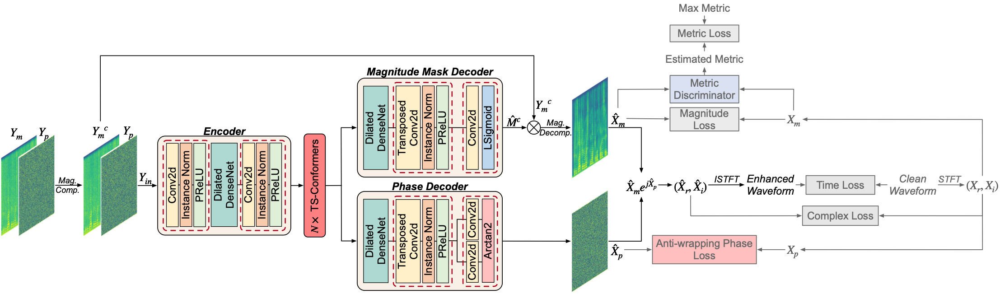

#  MP-SENet: A Speech Enhancement Model with Parallel Denoising of Magnitude and Phase Spectra 
[paper](https://arxiv.org/abs/2305.13686). This source code is for training models MP SENet and MTFAA Net. Share checkpoint files that have achieved good results.

## Requisites
1. Python >= 3.8.
2. Clone this repository.
3. Install python requirements. Please refer [requirements.txt](https://github.com/lx-cly/mpsenet-speech-enhanced/main/requirements.txt).
4. (opt) If you are a Linux system user, you need to manually install the underlying dependency library libsndfile of SoundFile.Please refer to the following command:
  ```
  sudo apt-get update
  sudo apt-get install libsndfile1
  ```
## Datasets
We use the [ICASSP_2021_DNS_Challenge dataset](https://modelscope.cn/datasets/modelscope/ICASSP_2021_DNS_Challenge/summary) for training and testing.

## Training
```
CUDA_VISIBLE_DEVICES=0,1 python train.py --config config.json
```
Checkpoints and copy of the configuration file are saved in the `cp_mpsenet` directory by default.<br>
You can change the path by adding `--checkpoint_path` option.

## Inference
```
python inference.py --checkpoint_file [generator checkpoint file path]
```
You can also use the pretrained best checkpoint file we provide in [weights/mpsenet](https://huggingface.co/lx-ljl/MPSENET).<br>
Generated wav files are saved in `generated_files` by default.<br>
You can change the path by adding `--output_dir` option.

## Gradio Demo
You should first download the weight file to `wights/`, then you can use the Gradio demo to try the model.<br>
```
python app.py 
```


## Model Structure


## Acknowledgements
* [FRCRN](https://modelscope.cn/models/damo/speech_frcrn_ans_cirm_16k/summary)
* [MP-SENet](https://github.com/yxlu-0102/MP-SENet)
* [MTFAA-Net](https://github.com/echocatzh/MTFAA-Net) 


